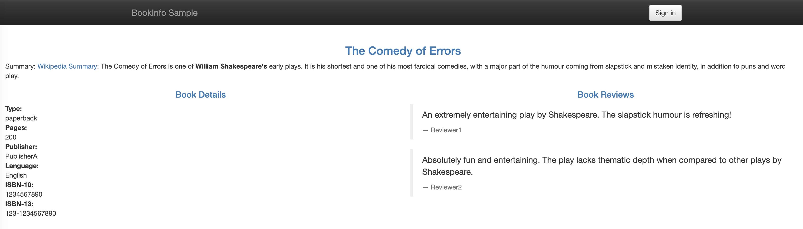

# consul-bookinfo
## Split reviews microservice traffic by version 

This example assumes that Bookinfo and Consul are both deployed following the instructions in `../1-service-defaults`.

The service-resolver and service-splitter examples below are also available as JSON files in this directory.

```bash
$ consul config write -<<EOF
{
  "kind": "service-resolver",
  "name": "reviews",

  "subsets": {
    "v1": {
      "filter": "Service.Meta.version == v1"
    },
    "v2": {
      "filter": "Service.Meta.version == v2"
    },
    "v3": {
      "filter": "Service.Meta.version == v3"
    }
  }
}
EOF
Config entry written: service-resolver/reviews
```

To direct all traffic to v1 of the reviews service:
```bash
$ consul config write -<<EOF
{
  "kind": "service-splitter",
  "name": "reviews",
  "splits": [
    {
      "weight": 100,
      "service_subset": "v1"
    },
    {
      "weight": 0,
      "service_subset": "v2"
    },
    {
      "weight": 0,
      "service_subset": "v3"
    }
  ]
}
EOF
Config entry written: service-splitter/reviews
```

To confirm that we are no longer round-robin-ing traffic between the three versions, check out the productpage once more. If you do not have the external IP, you can get the LB address by running: 
```bash
$ oc get services productpage
NAME          TYPE           CLUSTER-IP       EXTERNAL-IP   PORT(S)        AGE
productpage   LoadBalancer   <INTERNAL_IP>    <EXTERNAL_IP> 80:31990/TCP   32m
```

Visit `<EXTERNAL_IP>/productpage` and you should see a page like the following:



Refreshing the page will no longer alternate between the three versions. You will only see the version without the star ratings (reviews-v1).

Next, we will split traffic 50/50 between v2 and v3 of the reviews service. After this point, v1 will no longer receive traffic.
```bash
$ consul config write -<<EOF
{
  "kind": "service-splitter",
  "name": "reviews",
  "splits": [
    {
      "weight": 0,
      "service_subset": "v1"
    },
    {
      "weight": 50,
      "service_subset": "v2"
    },
    {
      "weight": 50,
      "service_subset": "v3"
    }
  ]
}
EOF
Config entry written: service-splitter/reviews
```

Finally, we still want to collect user feedback on v3 so a small subset will continue to see the red stars.
```bash
$ consul config write -<<EOF
{
  "kind": "service-splitter",
  "name": "reviews",
  "splits": [
    {
      "weight": 0,
      "service_subset": "v1"
    },
    {
      "weight": 90,
      "service_subset": "v2"
    },
    {
      "weight": 10,
      "service_subset": "v3"
    }
  ]
}
EOF
Config entry written: service-splitter/reviews
```
