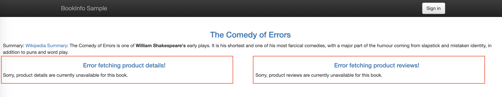
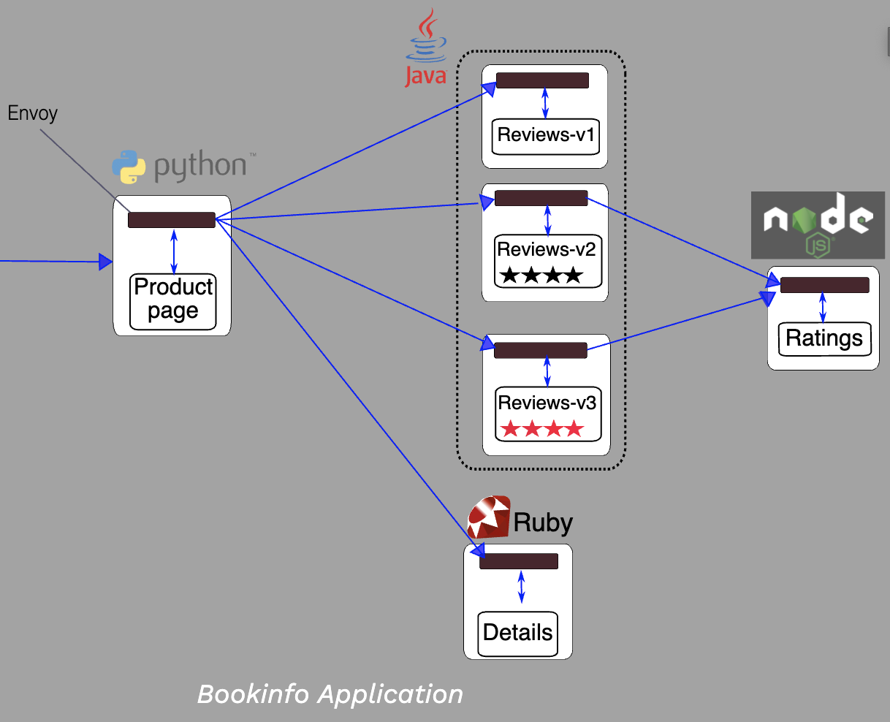
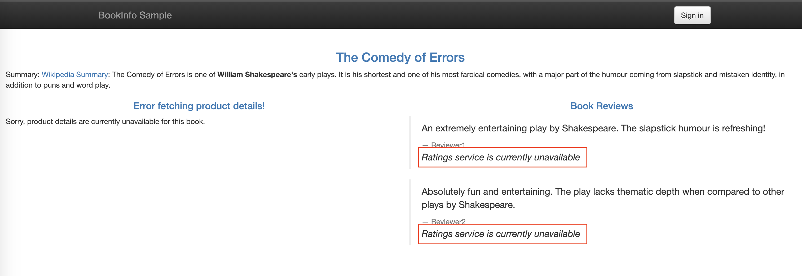
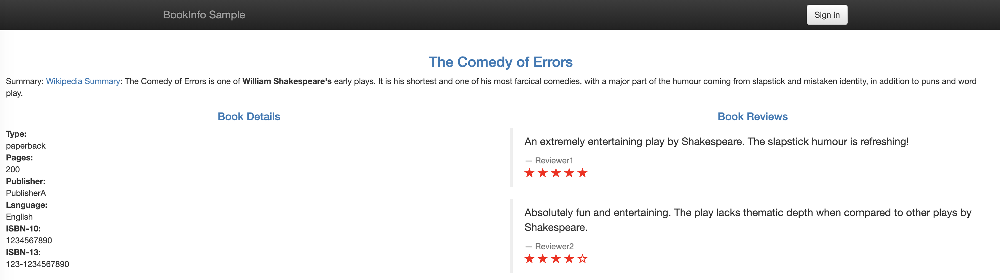
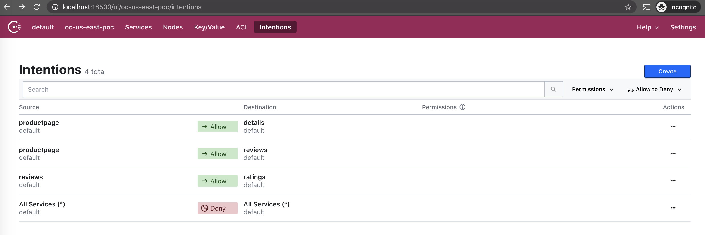
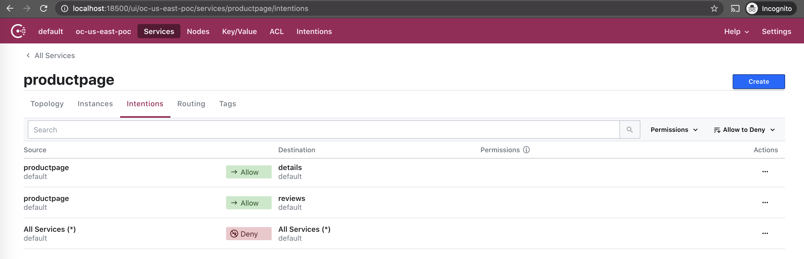
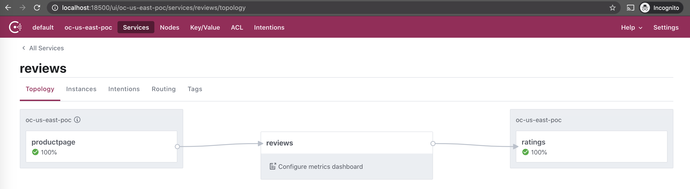

# consul-bookinfo
## restrict approved service communication with Consul Intentions

This example assumes that Bookinfo and Consul are both deployed following the instructions in `../1-service-defaults`.

Intentions allow you to segment routing much like traditional firewalls but they rely on the services' logical names (for example "reviews" or "productpage") rather than the IP addresses of each individual service instance.

This is incredibly important as we route between dynamic, containerized services. The IP address can change frequently and might even overlap across clusters. Intentions are enforced on inbound connections or requests by the proxy or within a natively integrated application. 

**NOTE:** changing intentions does not affect existing connections. A new connection must be established to see the effects of a changed intention.

Depending upon the protocol in use by the destination service, you can define intentions to control Connect traffic authorization either at networking layer 4 (e.g. TCP) and networking layer 7 (e.g. HTTP):

- **Identity-based (L4):** Only require awareness of the TLS handshake that wraps the TCP connection. These rely on the identites encoded within the TLS certificate and provide coarse allow/deny access controls between pairs of services.
- **Application-aware (L7):** A new feature in Consul 1.9.0, these can enforce access based on L7 request attributes in addition to connection identity. These can only be defined for services with HTTP-based protocols.

At any point, **only one intention controls authorization** -- it does not matter if that is an L4 or L7 intention.

Default intention behavior is controlled by the default [ACL policy](https://www.consul.io/docs/agent/options#acl_default_policy) 

There are different ways to configure intentions (UI, CLI, API) and they can be passed into payloads as `service-intentions` config entries. There is also a [precedence order](https://www.consul.io/docs/connect/intentions#precedence-and-match-order) that Consul will respect if multiple intentions (including wildcards) match a given request.

Intentions are cached locally on Consul agents and updated via a background blocking query. Supported proxies, like Envoy, will also cache this data so that inbound connections do not need to check against the Consul agent. Even if Consul agents are severed from Consul servers or if proxies cannot communicate with their local agent, the latest cached intentions will continue to be enforced. Changes to intentions, however, would not be retrieved until connectivity is restored up the chain.

## Examples
If necessary, log into one of the consul nodes:
```bash
$ oc exec -it consul-a1b2c3 -- /bin/sh
```

### Checking intentions
A pair of services can be evaluated to identify if a connection would be allowed or denyed:

```bash
$ consul intention check productpage reviews
Allowed
```

The `consul intention match` command can also be used to retrieve the list of intentions that match a given source or destination in the order that they would be evaluated:

```bash
$ consul intention match productpage
```

A wildcard can also be used:

```bash
$ consul intention match "*"
```

Similarly, the API endpoint `/connect/intentions` can be used to return a filtered set of results:

Sample Request:
```bash
$ curl \
 'http://127.0.0.1:8500/v1/connect/intentions?filter=SourceName==productpage'
```

We will use these again after we have configured some intentions. 

### Deny All
By default, Consul will reflect the default ACL policy. To override this or set a default deny all intention, we can run:

```bash
$ consul intention create -deny "*" "*"
Created: * => * (deny)
```

Re-running our earlier `intention match` and `intention check` commands will indicate that traffic is now disallowed by default:

```bash
$ consul intention match "*"
* => * (deny)

$ consul intention match productpage
* => * (deny)

$ consul intention check productpage reviews
Denied
```

If we check on the app using its external IP (or port forwarding), we should see an error: 


### Allow services explicitly
Our goal is to permit our services to follow the original bookinfo application pattern:


We will need to allow the following:
- FROM productpage TO reviews
- FROM productpage TO details
- FROM reviews TO ratings

Let's try this piece by piece. First, allow `productpage => reviews`:

```bash
$ consul intention create -allow productpage reviews
Created: productpage => reviews (allow)
```

Now, if we check on that again, we can see that traffic is allowed:
```bash
$ consul intention check productpage reviews
Allowed
```

While the reviews are now appearing in the web app (and for all versions of the reviews service), the ratings are not accessible from the reviews app:


To fix the remaining connections, we will allow `reviews => ratings` and `productpage => details`:

```bash
$ consul intention create -allow reviews ratings
Created: reviews => ratings (allow)

$ consul intention create -allow productpage details
Created: productpage => details (allow)
```

If we take a look at the `connect/intentions` endpoint once more for `productpage`, we'll now see:

```bash
$ curl \
 'http://127.0.0.1:8500/v1/connect/intentions?filter=SourceName==productpage'
```

```json
[
  {
    "CreatedAt": "2020-12-03T17:13:48.358757773Z",
    "UpdatedAt": "2020-12-03T17:13:48.358757773Z",
    "ID": "1ff56b2b-fb55-097f-09fa-53508e7b7623",
    "SourceNS": "default",
    "SourceName": "productpage",
    "DestinationNS": "default",
    "DestinationName": "details",
    "SourceType": "consul",
    "Action": "allow",
    "Precedence": 9,
    "Hash": "zYupGWQTY2aCtGKGwaFmkwmtI1x/diKFS+6lV9gsBig=",
    "CreateIndex": 1160176,
    "ModifyIndex": 1160176
  },
  {
    "CreatedAt": "2020-12-03T17:07:29.751038341Z",
    "UpdatedAt": "2020-12-03T17:07:29.751038341Z",
    "ID": "2f2ff97f-d48e-b6a2-d6f2-5a47103744fd",
    "SourceNS": "default",
    "SourceName": "productpage",
    "DestinationNS": "default",
    "DestinationName": "reviews",
    "SourceType": "consul",
    "Action": "allow",
    "Precedence": 9,
    "Hash": "LtuKhoK/voPUSYxAx0lRvTRcG0pHwhm6VsX7PH/1wRQ=",
    "CreateIndex": 1159659,
    "ModifyIndex": 1159659
  }
]
```

We should also now see a working bookinfo app again:


And if we connect to the Consul UI, we can also check out the visual representation:
```bash
$ kubectl port-forward pod/consul-server-0 18500:8500
```

We can see all of the intentions in the main Intentions tab:


And each service with configured intentions will report them in their respective page (from Services tab):


When we had denied `reviews => ratings` traffic, it would have been visualized from `services/reviews/topology` as:


And upon allowing that traffic, the topology for reviews would display that the route is permitted:

 

## Cleanup
We can delete all intentions via the UI, CLI, or API. 

If necessary, log into one of the consul nodes:
```bash
$ oc exec -it consul-a1b2c3 -- /bin/sh
```

We can delete any intention between `productpage` and `reviews` without specifying the action (allow / deny) 
```bash
$ consul intention delete productpage reviews
Intention deleted.
```

Starting in Consul 1.9.0, intentions can be deleted [via the API by name](https://www.consul.io/api-docs/connect/intentions#delete-intention-by-name) (as opposed to [by UUID](https://www.consul.io/api-docs/connect/intentions#delete-intention-by-id))
```bash
$ curl \
 --request DELETE \
 'http://127.0.0.1:8500/v1/connect/intentions/exact?source=productpage&destination=details'
true
```

To delete all the intentions we created, including the default one, we can run the following:
```bash
$ consul intention delete productpage reviews
$ consul intention delete productpage details
$ consul intention delete reviews ratings 
$ consul intention delete "*" "*"
```

If everything was deleted, `productpage => reviews` and `productpage => ratings` (which we had not previously allowed) should both work:
```bash
$ consul intention match productpage

$ consul intention check productpage reviews
Allowed

$ consul intention check productpage ratings
Allowed
```


## References
- [https://www.consul.io/docs/connect/intentions](https://www.consul.io/docs/connect/intentions)
- [https://www.consul.io/docs/agent/options#acl_default_policy](https://www.consul.io/docs/agent/options#acl_default_policy)
