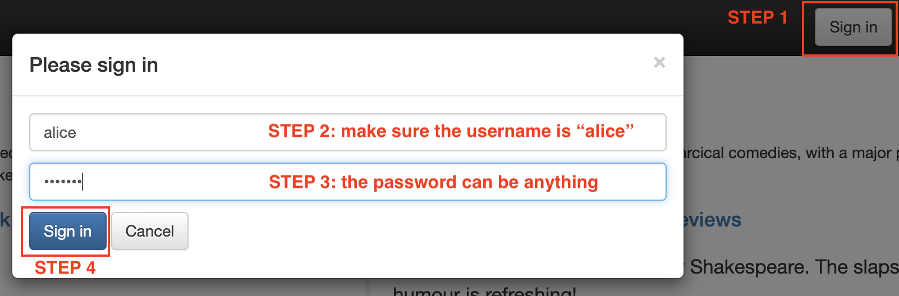
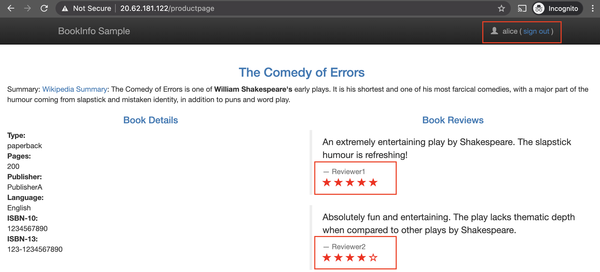
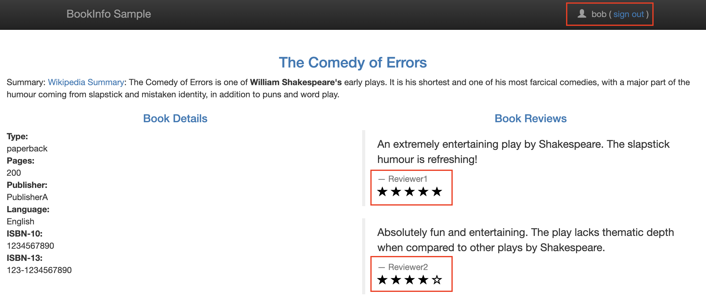

# Consul Service Router
Layer 7 traffic management allows operators to divide L7 traffic between different subsets of service instances when using Connect. By default, Consul will roundrobin traffic to healthy service instances but with Consul's L7 traffic management capabilities, more advanced strategies like canary , A/B or blue/green, or other testing methodologies can be used to intelligently route traffic. 

Consul's `service-router` config entry kind can intercept traffic and change routing behavior based on L7 criteria such as path prefixes or HTTP headers.

This example assumes that Bookinfo and Consul are both deployed following the instructions in `../1-service-defaults`.

### Application Architecture 


## Routing Matches
The bookinfo application provides a few different ways for us to manipulate some L7 data: 

1. **Query Parameters:** `/productpage?u=normal` or `/productpage?u=testuser`
2. **HTTP Headers:** after login, an `end-user` header is added to backend service requests, for example: `end-user: alice` or `end-user: bob` 

We will use the headers because those are passed through from productpage to the reviews services. The query string is only sent to productpage without further manipulation. 

Our goal is to force each user to see a specific version of the reviews service. 
1. requests with the HTTP header `end-user: alice` will always go to reviews-v3
2. requests with the HTTP header `end-user: bob` will always go to reviews-v2
3. all other requests will only see reviews-v1 (although we can also use a `service-splitter` to loadbalance among multiple subsets)


## Examples
If necessary, log into one of the consul nodes:
```bash
$ oc exec -it consul-a1b2c3 -- /bin/sh
```

Since we will be manipulating `serivce-router` config entries, we can see what are already configured with the following command:

```bash
$ consul config list -kind service-router
bookinfo

$ consul config read -kind service-router -name bookinfo
{
    "Kind": "service-router",
    "Name": "bookinfo",
    "Namespace": "default",
    "Routes": [
        {
            "Match": {
                "HTTP": {
                    "PathPrefix": "/reviews"
                }
            },
            "Destination": {
                "Service": "reviews",
                "Namespace": "default"
            }
        },
#
# [ . . . snip . . . ]
#
}
```

These can also be queried via the API:

### Sample Request
```bash
$ curl \
 --request GET \
 http://127.0.0.1:8500/v1/config/service-router

# A name can also be specified in the request:
$ curl \
 --request GET \
 http://127.0.0.1:8500/v1/config/service-router/bookinfo
```

### Sample Response
```bash
[
  {
    "Kind": "service-router",
    "Name": "bookinfo",
    "Routes": [
      {
        "Match": {
          "HTTP": {
            "PathPrefix": "/reviews"
          }
        },
        "Destination": {
          "Service": "reviews",
          "Namespace": "default"
        }
      },
#
# [ . . . snip . . . ]
#
]
```

In our default deployment, we have already been using the L7 routing functionality! Requests from `productpage:9090` are being issued to `bookinfo:9080` through the envoy sidecar proxy. When the request's HTTP [PathPrefix](https://www.consul.io/docs/agent/config-entries/service-router#pathprefix) matches one of the strings we've configured, like `/reviews`, it is directed to the corresponding destination service (i.e., reviews).

We will further extend this by using another [HTTP-specific match criteria](https://www.consul.io/docs/agent/config-entries/service-router#serviceroutehttpmatch), [Header](https://www.consul.io/docs/agent/config-entries/service-router#header), which we will match against `end-user` to determine how to route Alice and Bob to their respective reviews service versions. 

**Note:** Consul can also match against [QueryParam](https://www.consul.io/docs/agent/config-entries/service-router#queryparam).
 
First, let's add our `service-resolver` back in to define service subsets. You might have seen this in the `../2-service-splitter` example:

```bash
$ consul config write -<<EOF
{
  "kind": "service-resolver",
  "name": "reviews",
  "defaultsubset": "v1",
  "subsets": {
    "v1": {
      "filter": "Service.Meta.version == v1"
    },
    "v2": {
      "filter": "Service.Meta.version == v2"
    },
    "v3": {
      "filter": "Service.Meta.version == v3"
    }
  }
}
EOF
Config entry written: service-resolver/reviews
```

This config is also provided in this directory as [reviews-service-resolver.json](https://github.com/tonyp-hc/consul-bookinfo/blob/main/4-service-router/reviews-service-resolver.json).

Previously, we had not defined a `service-resolver` so we were balanced across all available instances. Now, hitting `<EXTERNAL_IP>/productpage` should no longer roundrobin between the different versions of the reviews service. It should only hit the `defaultsubset` we defined: **v1**.

While we are using exact matches for the next few examples, all `Match` fields (e.g., path, header, query) provide additional flexiblity:

**Supported Match Types**
- **Path:**  exact, prefix, or regex
- **Header:** exact, prefix, suffix, regex, or present
- **Query:** exact, regex, or present

At most, only one of these match types is supported for each condition.

Apply the modified `service-router` configuration below. It will overwrite the existing config with the same name (`bookinfo`) and kind (`service-router`).

```bash
consul config write -<<EOF
Kind = "service-router"
Name = "bookinfo"
Routes = [
  {
    Match {
      HTTP {
        Header = [
          {
            Name  = "end-user"
            Exact = "alice"
          },
        ],
        PathPrefix = "/reviews"
      }
    }
    Destination {
      Service       = "reviews"
      ServiceSubset = "v3"
    }
  },
  {
    Match {
      HTTP {
        PathPrefix = "/reviews"
      }
    }

    Destination {
      Service = "reviews",
    }
  },
  {
    Match {
      HTTP {
        PathPrefix = "/details"
      }
    }

    Destination {
      Service = "details",
    }
  },
  {
    Match {
      HTTP {
        PathPrefix = "/ratings"
      }
    }

    Destination {
      Service = "ratings",
    }
  }
]
EOF
Config entry written: service-router/bookinfo
```

This config is also provided in this directory as [service-router.sh](https://github.com/tonyp-hc/consul-bookinfo/blob/main/4-service-router/service-router.sh).

**Note:** Our new Header `Match` examples specify a `ServiceSubset` which allows them to resolve directly against the `service-resolver` we (re)defined earlier. Destinations that omit a `ServiceSubset` are eligible for [splitting](https://www.consul.io/docs/agent/config-entries/service-splitter) via a `service-splitter`.


Visiting `<EXTERNAL_IP>/productpage` should still only return reviews-v1 (no stars). Let's try logging in:


1. Click the "Sign in" button in the top right of the header
2. Provide "alice" as the username 
3. Any password will work
4. Click the blue "Sign in" button on the form to proceed.

Now you will be logged in as Alice (as indicated in the site header) and should see that we are routed to reviews-v3 (red stars):


If you hit refresh, you will only see reviews-v3 being fetched.

Use the "sign out" text at the top right and we'll be back to the default, no star UI of reviews-v1.

Repeat the login process once more with "bob" as the username and you will see reviews-v2 instead (black stars):



## Cleanup
To remove all this, we will remove the `service-resolver` and delete the new Match entries in our bookinfo `service-router`.

**Note:** You could leave the `service-resolver` in and configure a `serivice-spliter` instead that distributes traffic between all three of our service subsets to achieve the same effect.

```bash
consul config write -<<EOF
Kind = "service-router"
Name = "bookinfo"
Routes = [
  {
    Match {
      HTTP {
        PathPrefix = "/reviews"
      }
    }

    Destination {
      Service = "reviews",
    }
  },
  {
    Match {
      HTTP {
        PathPrefix = "/details"
      }
    }

    Destination {
      Service = "details",
    }
  },
  {
    Match {
      HTTP {
        PathPrefix = "/ratings"
      }
    }

    Destination {
      Service = "ratings",
    }
  }
]
EOF
```

This config is also provided in this directory as [service-router-original.sh](https://github.com/tonyp-hc/consul-bookinfo/blob/main/4-service-router/service-router-original.sh).

Once we remove the `Match` cases for our `end-user` header, even logged in as Alice or Bob we will only see reviews-v1 (no stars).

If we remove the `service-resolver` though, we will once again roundrobin:

```bash
$ consul config delete -kind service-resolver -name reviews
Config entry deleted: service-resolver/reviews
``` 

## References
- [https://www.consul.io/docs/connect/l7-traffic](https://www.consul.io/docs/connect/l7-traffic)
- [https://www.consul.io/commands/config/list](https://www.consul.io/commands/config/list)
- [https://www.consul.io/api-docs/config](https://www.consul.io/api-docs/config)
