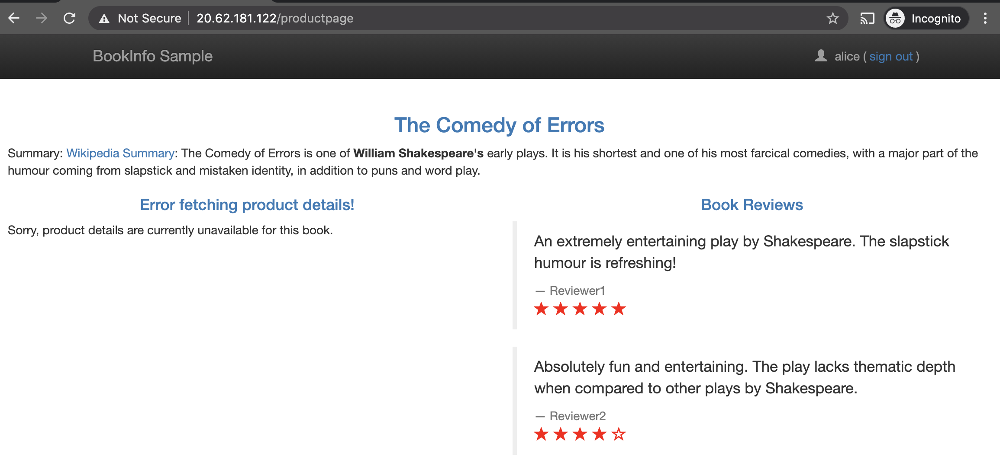
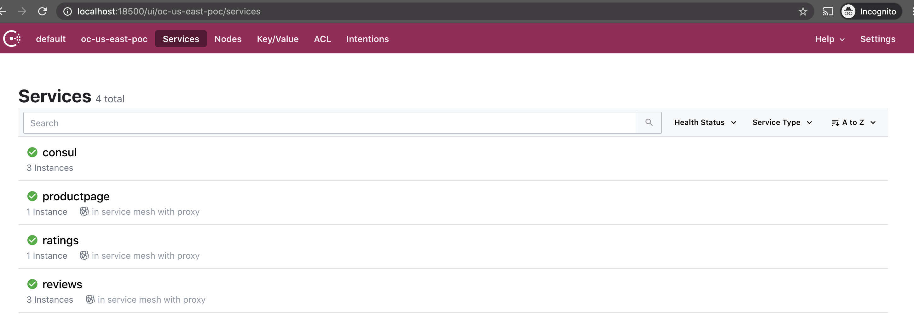

# Consul Cross-Namespace Routing 
Many modern platforms, like Kubernetes and Consul, support *Namespaces*. While the fine implementation and configuration details vary across platforms, at a high level namespaces provide a multi-tenancy solution with some form of isolation or partitioning between logical segments. Often, these segments align to business-specific boundaries, like business units, applications, or environments. They also provide a scope for names since (in most platforms) service names only need to be unique within a namespace; not across namespaces.

### Application Architecture 
In the original bookinfo deployment, everything was deployed into a single namespace (the same one as Consul):


Many organizations use namespaces as one method of enforcing swim lanes between groups/applications/environments. Our example is therefore atypical so we will adjust it slightly to begin exploring how Consul can interact with K8s or Openshift services in other namespaces:


We will redeploy the details service into its own namespace and have Consul route requests from the productpage service to its new neighbor.

Later on, we will explore how this can also support additional traffic control patterns like failover or canary testing. 

## Consul Enterprise Namespaces vs Kubernetes Namespaces
As of Consul Enterprise 1.7.0, both Consul Enterprise and Kubernetes (and thereby Openshift) have their own namespace implementations. [Consul Enterprise Namespaces](https://www.consul.io/docs/enterprise/namespaces) solve the similar challenges as K8s namespaces and provide another method of isolation for teams. They also allow self-service capabilities for operators through delegation of administrative privileges.

They are a separate implementation, however, because Consul focuses on multi-runtime support. There might be (and likely are) services registered in Consul that are not coming from your K8s clusters! This allows organizations to support a layered, cross-functional strategy as they transition from traditional infrastructure patterns (bare metal, VMs) to containerized workloads (K8s, Openshift).

### Managing Consul's Access to K8s Namespaces 
By default, all valid service types are synced from every Kubernetes namespace (except for `kube-system` and `kube-public`). This, as well as injection overall can be [controlled](https://www.consul.io/docs/k8s/connect#controlling-injection-via-namespace) via the `k8sAllowNamespaces` and `k8sDenyNamespaces` keys.

By default, services from all namespaces are allowed to be injected. Whether or not they're injected depends on the value of `connectInject.default` and the `consul.hashicorp.com/connect-inject` annotation.

In our [deployment manifest](https://github.com/tonyp-hc/consul-helm-openshift/blob/main/manifests/consul/templates/connect-inject/connect-inject-deployment.yaml#L47-L54), you can see that we have configured `-default-inject=false` and `-allow-k8s-namespaces="*"`. Most users will have set these via the aforementioned config values during a Helm deployment. 

### Mirroring K8s and Consul Enterprise Namespaces
[Consul Enterprise Namespaces](https://www.consul.io/docs/k8s/service-sync#consul-enterprise-namespaces) can sync from Kubernetes to Consul (although not vice-versa). There are three options available:
1. **Single Destination Namespace:** Sync all K8s services, regardless of namespace, into the same Consul namespace
2. **Mirror Namespaces:** Each K8s service will be synced to a Consul Enterprise namespace with the same name as its K8s namespace
3. **Mirror NS with Prefix:** Each K8s service will be synced to a Consul Enterprise namespace with the same name as its K8s namespace AND a prefix, for example: given a prefix of `k8s`, service `foo` in K8s namespace `us-nyc-dc1` will be synced to the Consul Enterprise namespace `k8s-us-nyc-dc1`. 

There is also the option, `addK8SNamespaceSuffix` which can append the K8s namespace as a suffix to the **synced service name** in Consul. Using the earlier example of a service `foo`, and a K8s namespace of `us-nyc-dc1`, the service registered in Consul Enterprise would be: `foo-us-nyc-dc1` 


## Examples
This example assumes that Bookinfo and Consul are both deployed following the instructions in `../1-service-defaults`.

We will step through a few examples but will start by focusing on just a single Consul Enterprise namespace (default). All of our K8s/Openshift services are being synced to the `default` Consul Enterprise namespace.

If we take a look at the current pods, we will see all our bookinfo application services in the originally deployed 'consul' Openshift namespace:

```bash
$ oc get pods -l 'app in (details,reviews,ratings,productpage)'
NAME                              READY   STATUS    RESTARTS   AGE
details-v1-697ffd6cc-lbwmh        3/3     Running   0          36h
productpage-v1-847b8458cd-vtbzm   3/3     Running   0          36h
ratings-v1-784759b777-qwsrq       3/3     Running   0          36h
reviews-v1-5656f98f88-w776t       3/3     Running   0          36h
reviews-v2-77796bd6db-7qrsw       3/3     Running   0          36h
reviews-v3-9d586dbf-dkhjp         3/3     Running   0          36h

$ kubectl config get-contexts --no-headers | grep '*' | grep -Eo '\S+$'
consul
```

We will need to:
1. Delete the current details service
2. Create a new `details` namespace/project for the details service
3. Deploy details to the new `details` namespace
4. Instruct Consul to route requests from `productpage` to `details` but in the new namespace

We do not need to update our Consul connect-inject deployment because we have already allowed it to run in all K8s namespaces. We will, however, need to be more explicit in our service configurations.

There is a new YAML file in this directory called `details-consul-ns.yaml` which we will use to delete the current details service (and recreate it later).

```bash
$ oc delete -f details-consul-ns.yaml
serviceaccount "details" deleted
deployment.apps "details-v1" deleted

$ oc get pods -l 'app in (details,reviews,ratings,productpage)'
NAME                              READY   STATUS    RESTARTS   AGE
productpage-v1-847b8458cd-vtbzm   3/3     Running   0          37h
ratings-v1-784759b777-qwsrq       3/3     Running   0          37h
reviews-v1-5656f98f88-w776t       3/3     Running   0          37h
reviews-v2-77796bd6db-7qrsw       3/3     Running   0          37h
reviews-v3-9d586dbf-dkhjp         3/3     Running   0          37h
``` 

The details section of the site should now be broken:


In fact, since we deleted the only instance of that service, that service is no longer part of our consul registry:
 

Let's create a new namespace and (unoriginally) call it `details`. 

```bash
$ oc create ns details
namespace/details created

# switch to the new namespace
$ oc config set-context --current --namespace=details
Context "admin" modified.

# clean working context
$ oc get pods
No resources found in details namespace.
```

```bash
$ oc apply -f details-details-ns.yaml
serviceaccount/details created
deployment.apps/details-v1 created

$ oc get pods,deployments,serviceaccounts
NAME                             READY   STATUS    RESTARTS   AGE
pod/details-v1-697ffd6cc-pl7rv   3/3     Running   0          3m18s

NAME                         READY   UP-TO-DATE   AVAILABLE   AGE
deployment.apps/details-v1   1/1     1            1           3m19s

NAME                     SECRETS   AGE
serviceaccount/default   1         13m
serviceaccount/details   1         3m19s
```

And we can see that the Consul sidecar has been injected:
```bash
$ oc describe deployment/details-v1  | grep consul
  Annotations:      consul.hashicorp.com/connect-inject: true

$ oc describe pod -l 'app=details'
#
# . . . [snip] . . . 
#
Annotations:  consul.hashicorp.com/connect-inject: true
              consul.hashicorp.com/connect-inject-status: injected
              consul.hashicorp.com/connect-service: details
              consul.hashicorp.com/connect-service-port: 9080
#
# . . . [snip] . . . 
#
```

And if we check on the productpage app and consul once more, we'll see that the details service is back online:

```bash
$ oc exec -it consul-server-0 -- consul catalog services
consul
details
details-sidecar-proxy
productpage
productpage-sidecar-proxy
ratings
ratings-sidecar-proxy
reviews
reviews-sidecar-proxy
```

But wait, we deployed it to a separate namespace. Why did productpage automatically route to the new namespace?

Earlier, we learned that K8s namespaces are not (by default) mapped to Consul Enterprise namespaces. From the orchestrator's perspective, details is in the `details` namespace and the rest of bookinfo is in the `consul` namespace. However all of these services have been registered in the same Consul Enterprise namespace.

In the next example, we will update our Consul Enterprise servers to mirror select K8s namespaces.

**Note:** Even without Consul Enterprise Namespaces, you could add service metadata through an annotation to indicate which K8s namespace the service was deployed into. That metadata can be used to target a service subset through a `service-splitter` and/or `service-resolver` much like with the `version` key in  earlier examples. 

## Cleanup

Remove details app

```bash
$ oc -n details delete -f details-details-ns.yaml
serviceaccount "details" deleted
deployment.apps "details-v1" deleted

$ oc -n details get pods
No resources found in details namespace.
```


## References
- [https://www.consul.io/docs/k8s/connect#controlling-injection-via-namespace](https://www.consul.io/docs/k8s/connect#controlling-injection-via-namespace)
- [https://www.consul.io/docs/k8s/service-sync#consul-enterprise-namespaces](https://www.consul.io/docs/k8s/service-sync#consul-enterprise-namespaces)
- [https://www.consul.io/docs/enterprise/namespaces](https://www.consul.io/docs/enterprise/namespaces)
