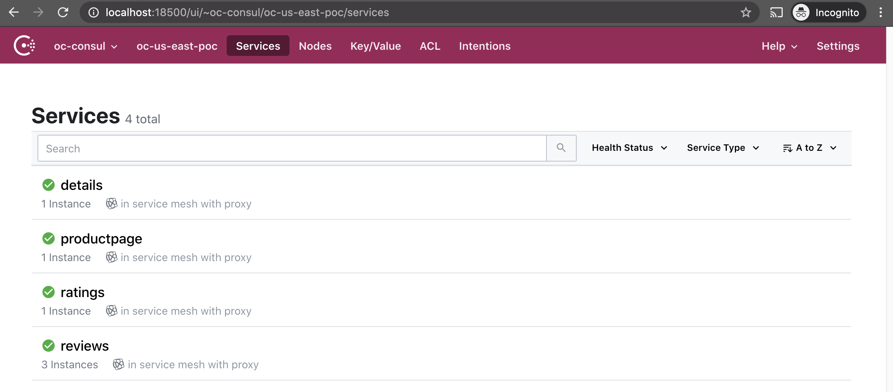
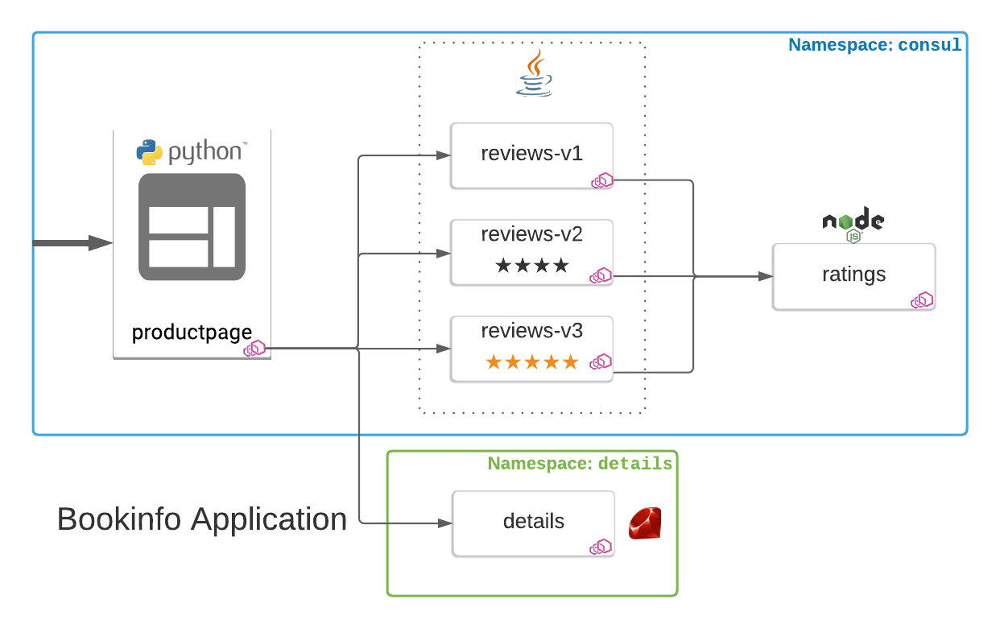

# Consul Cross-Namespace Routing 

## Consul Enterprise Namespaces vs Kubernetes Namespaces
As of Consul Enterprise 1.7.0, both Consul Enterprise and Kubernetes (and thereby Openshift) have their own namespace implementations. [Consul Enterprise Namespaces](https://www.consul.io/docs/enterprise/namespaces) solve the similar challenges as K8s namespaces and provide another method of isolation for teams. They also allow self-service capabilities for operators through delegation of administrative privileges.

They are a separate implementation, however, because Consul focuses on multi-runtime support. There might be (and likely are) services registered in Consul that are not coming from your K8s clusters! This allows organizations to support a layered, cross-functional strategy as they transition from traditional infrastructure patterns (bare metal, VMs) to containerized workloads (K8s, Openshift).

### Managing Consul's Access to K8s Namespaces 
By default, all valid service types are synced from every Kubernetes namespace (except for `kube-system` and `kube-public`). This, as well as injection overall can be [controlled](https://www.consul.io/docs/k8s/connect#controlling-injection-via-namespace) via the `k8sAllowNamespaces` and `k8sDenyNamespaces` keys.

By default, services from all namespaces are allowed to be injected. Whether or not they're injected depends on the value of `connectInject.default` and the `consul.hashicorp.com/connect-inject` annotation.

In our [deployment manifest](https://github.com/tonyp-hc/consul-helm-openshift/blob/main/manifests/consul/templates/connect-inject/connect-inject-deployment.yaml#L47-L54), you can see that we have configured `-default-inject=false` and `-allow-k8s-namespaces="*"`. Most users will have set these via the aforementioned config values during a Helm deployment. 

### Mirroring K8s and Consul Enterprise Namespaces
[Consul Enterprise Namespaces](https://www.consul.io/docs/k8s/service-sync#consul-enterprise-namespaces) can sync from Kubernetes to Consul (although not vice-versa). There are three options available:
1. **Single Destination Namespace:** Sync all K8s services, regardless of namespace, into the same Consul namespace
2. **Mirror Namespaces:** Each K8s service will be synced to a Consul Enterprise namespace with the same name as its K8s namespace
3. **Mirror NS with Prefix:** Each K8s service will be synced to a Consul Enterprise namespace with the same name as its K8s namespace AND a prefix, for example: given a prefix of `k8s`, service `foo` in K8s namespace `us-nyc-dc1` will be synced to the Consul Enterprise namespace `k8s-us-nyc-dc1`. 

There is also the option, `addK8SNamespaceSuffix` which can append the K8s namespace as a suffix to the **synced service name** in Consul. Using the earlier example of a service `foo`, and a K8s namespace of `us-nyc-dc1`, the service registered in Consul Enterprise would be: `foo-us-nyc-dc1` 


## Examples
Earlier, we learned that K8s namespaces are not (by default) mapped to Consul Enterprise namespaces. From the orchestrator's perspective, details is in the `details` namespace and the rest of bookinfo is in the `consul` namespace. However all of these services have been registered in the same Consul Enterprise namespace.

We can, however, provide specific instructions to Consul how it should route between or across namespaces. But first we will need to update Consul Enterprise to sync some k8s namespace metadata.

**Note:** This functionality requires Consul Enterprise >=1.7.0 or >=1.9.0 if deploying to Openshift.

First, delete the bookinfo app deployment we've done so far following the [Cleanup](https://github.com/tonyp-hc/consul-bookinfo/tree/main/1-service-defaults#cleanup) instructions. 

Verify that we have de-registered all the bookinfo services:
```bash
$ oc get pods -l 'app in (details,reviews,ratings,productpage)'
No resources found in consul namespace.
``` 

Next, we need to enable Consul Enterprise namespaces. Follow the instructions in our [consul-helm-openshift](https://github.com/tonyp-hc/consul-helm-openshift#enabling-consul-enterprise-namespaces) repo.

If successful, we can run the following command:

```bash
$ oc exec -it consul-server-0 -- consul namespace list
default:
   Description:
      Builtin Default Namespace
```

Now let's deploy the bookinfo services once more, but we'll be using a slightly different `service-default` and `service-router` config.

Make sure we're in the consul namespace:

```bash
$ oc config set-context --current --namespace=consul
Context "admin" modified.
```

And then from the `6-consul-namespaces` directory, we will deploy bookinfo again:

```bash
$ oc apply -f ../1-service-defaults/
serviceaccount/details created
deployment.apps/details-v1 created
service/productpage created
serviceaccount/productpage created
deployment.apps/productpage-v1 created
serviceaccount/ratings created
deployment.apps/ratings-v1 created
serviceaccount/reviews created
deployment.apps/reviews-v1 created
deployment.apps/reviews-v2 created
deployment.apps/reviews-v3 created
configmap/reviews created
```

That will deploy like normal: 

```bash
$ oc get pods -l 'app in (details,reviews,ratings,productpage)'
NAME                              READY   STATUS    RESTARTS   AGE
details-v1-697ffd6cc-rr2h5        3/3     Running   0          23s
productpage-v1-847b8458cd-7f8cq   3/3     Running   0          22s
ratings-v1-784759b777-xv7sl       3/3     Running   0          21s
reviews-v1-5656f98f88-6mpzm       3/3     Running   0          21s
reviews-v2-77796bd6db-wp6jp       3/3     Running   0          21s
reviews-v3-9d586dbf-llfjd         3/3     Running   0          22s
```

However, we can fire up the UI and see some differences:

```bash
$ kubectl port-forward pod/consul-server-0 18500:8500
```

Instead of the bookinfo app appearing in our main catalog, we still only see the consul service. Instead, the **default** dropdown on the top left lists a new option, **oc-consul**.


If we peek at [connect-inject-deployment.yaml](https://github.com/tonyp-hc/consul-helm-openshift/blob/main/enable-namespaces/connect-inject-deployment.yaml#L63-L64), we can see that we are now mirroring our K8s namespaces (`enable-k8s-namespace-mirroring`) and we are adding the prefix, "oc-" (`k8s-namespace-mirroring-prefix`).

We had deployed bookinfo into the `consul` K8s namespace so when it was registered in Consul, the Consul Enterprise namespace, `oc-consul`, was created.

You can also see this by using the `consul namespace` command like before:

```bash
$ oc exec -it consul-server-0 -- consul namespace list oc-consul
default:
   Description:
      Builtin Default Namespace
oc-consul:
   Description:
      Auto-generated by consul-k8s
   Meta:
      external-source: kubernetes
````

The `consul namespace read` command can be used to read a specific namespace configuration, instead of listing all of them:

```bash
$ oc exec -it consul-server-0 -- consul namespace read oc-consul
Name: oc-consul
Description:
   Auto-generated by consul-k8s
Meta:
   external-source: kubernetes
```

However, if we take a look at `<EXTERNAL_IP>/productpage` the details and reviews sections will still be broken. That's because we have not yet applied our new `service-defaults` and `service-router` configuration.

If necessary, log into one of the consul nodes:
```bash
$ oc exec -it consul-a1b2c3 -- /bin/sh
```

And apply the following `service-defaults` configuration. The commands are also available in the [service-defaults-ns.sh](https://github.com/tonyp-hc/consul-bookinfo/blob/main/6-consul-namespaces/service-defaults-ns.sh) file in this directory.

Notice that these are slightly different than the one we previously used -- we are now specifying the `namespace` field to reflect that we have deployed these services to the `consul` namespace in K8s which is mirrored to `oc-consul` in Consul Enterprise (based on our prefix convention).

```bash
$ cat service-defaults.sh
consul config write -<<EOF
{
  "kind": "service-defaults",
  "name": "reviews",
  "namespace": "oc-consul",
  "protocol": "http"
}
EOF
Config entry written: service-defaults/reviews
```

```bash
$ consul config write -<<EOF
{
  "kind": "service-defaults",
  "name": "details",
  "namespace": "oc-consul",
  "protocol": "http"
}
EOF
Config entry written: service-defaults/details
```

```bash
$ consul config write -<<EOF
{
  "kind": "service-defaults",
  "name": "bookinfo",
  "namespace": "oc-consul",
  "protocol": "http"
}
EOF
Config entry written: service-defaults/bookinfo
```

```bash
$ consul config write -<<EOF
{
  "kind": "service-defaults",
  "name": "productpage",
  "namespace": "oc-consul",
  "protocol": "http"
}
EOF
Config entry written: service-defaults/productpage
```

```bash
$ consul config write -<<EOF
{
  "kind": "service-defaults",
  "name": "ratings",
  "namespace": "oc-consul",
  "protocol": "http"
}
EOF
Config entry written: service-defaults/ratings
```

As mentioned, these are also available in the [service-defaults-ns.sh](https://github.com/tonyp-hc/consul-bookinfo/blob/main/6-consul-namespaces/service-defaults-ns.sh) file.

Next, apply the new `service-router` configuration:

```bash
consul config write -<<EOF
kind = "service-router"
name = "bookinfo"
namespace = "oc-consul"
routes = [
  {
    match {
      http {
        path_prefix = "/reviews"
      }
    }

    destination {
      service = "reviews",
    }
  },
  {
    match {
      http {
        path_prefix = "/details"
      }
    }

    destination {
      service = "details",
    }
  },
  {
    match {
      http {
        path_prefix = "/ratings"
      }
    }

    destination {
      service = "ratings",
    }
  }
]
EOF
Config entry written: service-router/bookinfo
```

Just like before, we are explicitly defining the Consul Enterprise namespace. This file is also available in the [service-router-ns.sh](https://github.com/tonyp-hc/consul-bookinfo/blob/main/6-consul-namespaces/service-router-ns.sh) file.

Like in the previous example, we are now going to move the details app into its own K8s namespace:



Delete it from the current namespace:

```bash
$ oc -n consul delete -f details-consul-ns.yaml
serviceaccount "details" deleted
deployment.apps "details-v1" deleted
```

```bash
$ oc -n consul get pods -l 'app=details'
No resources found in consul namespace.
```

Refreshing productpage will present a broken details pane as well. 

Create the `details` namespace if it does not exist:

```bash
$ oc create ns details
``` 

Redeploy details to its new namespace:

```bash
$ oc -n details apply -f details-details-ns.yaml
serviceaccount/details created
deployment.apps/details-v1 created
```

We should now see it in the new `details` namespace, and not the `consul` K8s namespace:

```bash
$ oc -n consul get pods -l 'app=details'
No resources found in consul namespace.

$ oc -n details get pods -l 'app=details'
NAME                         READY   STATUS    RESTARTS   AGE
details-v1-697ffd6cc-vskcj   3/3     Running   0          13s
```

And -- as expected this time -- the productpage is still not showing the details app. Let's fix that!

If necessary, log into one of the consul nodes:
```bash
$ oc exec -it consul-a1b2c3 -- /bin/sh
```

Apply `service-defaults` to our new `oc-details` Consul Enterprise namespace:

```bash
$ consul config write -<<EOF
{
  "kind": "service-defaults",
  "name": "details",
  "namespace": "oc-details",
  "protocol": "http"
}
EOF
Config entry written: service-defaults/details
```

These are also available in [service-defaults-ns-details.sh](https://github.com/tonyp-hc/consul-bookinfo/blob/main/6-consul-namespaces/service-defaults-ns-details.sh).

Finally, we need to update our original bookinfo `service-router` for the `oc-consul` namespace:

```bash
$ consul config write -<<EOF
kind = "service-router"
name = "bookinfo"
namespace = "oc-consul"
routes = [
  {
    match {
      http {
        path_prefix = "/reviews"
      }
    }

    destination {
      service = "reviews",
    }
  },
  {
    match {
      http {
        path_prefix = "/details"
      }
    }

    destination {
      service = "details",
      namespace = "oc-details",
    }
  },
  {
    match {
      http {
        path_prefix = "/ratings"
      }
    }

    destination {
      service = "ratings",
    }
  }
]
EOF
Config entry written: service-router/bookinfo
```

This updated config (available in [service-router-ns-consul.sh](https://github.com/tonyp-hc/consul-bookinfo/blob/main/6-consul-namespaces/service-router-ns-consul.sh)) has only a single change: we have now specified that bookinfo should route requests for `/details` to the corresponding service in the `oc-details` Consul Enterprise namespace.

And with that, we are back up and running!

 
## Cleanup
To get back to a stock setup of the bookinfo app (i.e., one namespace), we will need to delete our new config entries and then undeploy the app before deploying it back to its original namespace.

First, let's get rid of all these Consul config entries.

```bash
$ oc exec -it consul-server-0 -- consul config delete -kind service-router -name bookinfo -namespace=oc-consul
Config entry deleted: service-router/bookinfo

$ oc exec -it consul-server-0 -- consul config delete -kind service-defaults -name details -namespace=oc-details
Config entry deleted: service-defaults/details
```

Apply the previous `service-router` config entry for the `oc-consul` Consul namespace (the one that doesn't route to the `oc-details` Consul namespace):

Log into one of the consul nodes:

```bash
$ oc exec -it consul-a1b2c3 -- /bin/sh
```

Apply the original `service-router` config:

```bash
consul config write -<<EOF
kind = "service-router"
name = "bookinfo"
namespace = "oc-consul"
routes = [
  {
    match {
      http {
        path_prefix = "/reviews"
      }
    }

    destination {
      service = "reviews",
    }
  },
  {
    match {
      http {
        path_prefix = "/details"
      }
    }

    destination {
      service = "details",
    }
  },
  {
    match {
      http {
        path_prefix = "/ratings"
      }
    }

    destination {
      service = "ratings",
    }
  }
]
EOF
Config entry written: service-router/bookinfo
```

Delete the details app that we had deployed to the `details` K8s namespace:

```bash
$ oc -n details delete -f details-details-ns.yaml
serviceaccount "details" deleted
deployment.apps "details-v1" deleted

$ oc -n details get pods -l 'app=details'
No resources found in details namespace.
```

And finally, deploy the details app once more into the `consul` K8s namespace:

```bash
$ oc apply -n consul -f details-consul-ns.yaml
serviceaccount/details created
deployment.apps/details-v1 created

$ oc -n consul get pods -l 'app=details'
NAME                         READY   STATUS    RESTARTS   AGE
details-v1-697ffd6cc-m5g88   3/3     Running   0          28s
```


## References
- [https://www.consul.io/docs/k8s/connect#controlling-injection-via-namespace](https://www.consul.io/docs/k8s/connect#controlling-injection-via-namespace)
- [https://www.consul.io/docs/k8s/service-sync#consul-enterprise-namespaces](https://www.consul.io/docs/k8s/service-sync#consul-enterprise-namespaces)
- [https://www.consul.io/docs/enterprise/namespaces](https://www.consul.io/docs/enterprise/namespaces)
- [https://www.consul.io/commands/namespace](https://www.consul.io/commands/namespace)
